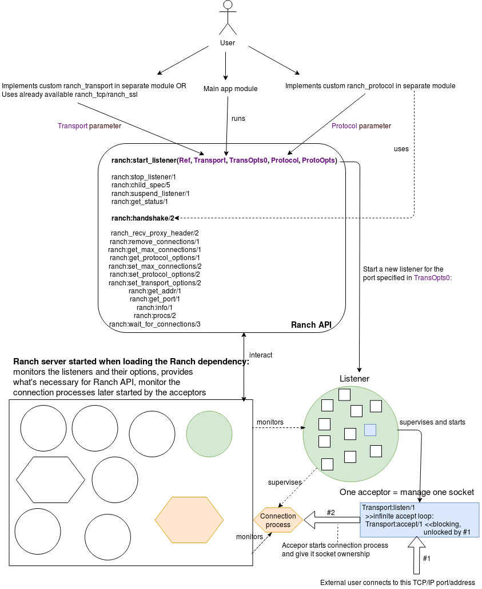

= Ranch: what's under the hood?

This document is a summary of my analysis of https://github.com/ninenines/ranch[Ranch] 2.0.0-rc.1 source code, performed in August 2019.
It has been done purely in an old-school manual way, cloning the project from github and going through it.

By helping understand the intricacy of a well-established but somewhat small Erlang library,
the reader can:

* improve its Erlang proficiency
* be able to help maintaining Ranch
* be able to reuse Ranch codebase or get inspired by it for other projects

WARNING: This analysis has been performed while I just started learning Erlang,
right after going through https://learnyousomeerlang.com/[Learn You Some Erlang For Great Good].
As a consequence, there may be some errors. Feedbacks are welcome! *WORK IN PROGRESS*

== Copyright and License

=== __Ranch: what's under the hood?__

Copyright © 2019, Nicolas Gimenez <nicolas.gimenez@baozi.technology>. +
__"Ranch: what's under the hood?"__ is published under the
link:LICENSE[Creative Commons Attribution-NonCommercial-ShareAlike 3.0 Unported License (CC BY-NC-SA 3.0)] +
More information on the license can be found
 https://creativecommons.org/licenses/by-nc-sa/3.0/[here].

=== __Ranch__

Ranch is copyrighted by https://github.com/essen[Loïc Hoguin],
which kindly encouraged me to publish this under-the-hood code analysis. +
I am not (yet ;) ) a contributor of this project.
I am not related to Nine Nines. +
Click https://salt.bountysource.com/teams/ninenines[here] if you wish to support Ranch.

== A taste of what's coming...

