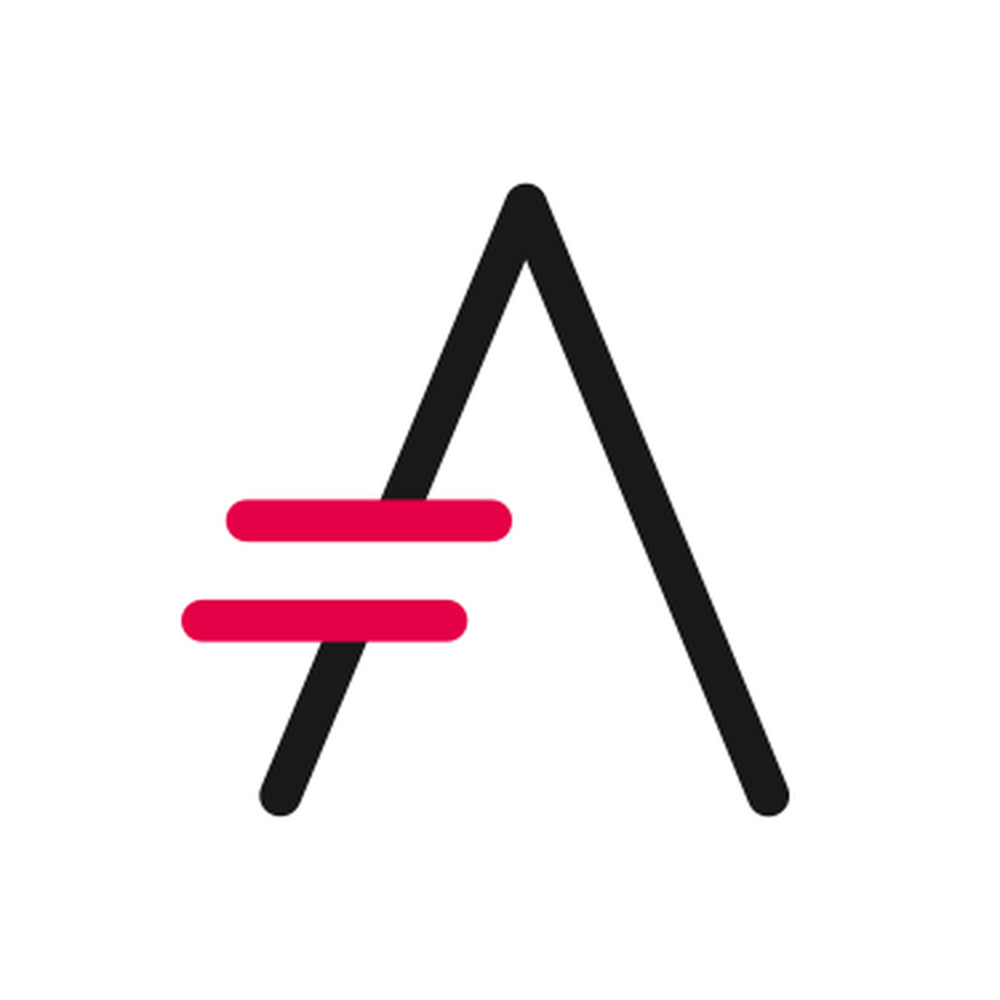

= Ranch: what's under the hood?

This document is a summary of my analysis of https://github.com/ninenines/ranch[Ranch] 2.0.0-rc.1 source code, performed in August 2019.
It has been done purely in an old-school way, cloning the project from github
and going through it manually.

By helping understand the intricacy of a well-established but somewhat small Erlang library,
the reader can:

* improve its Erlang proficiency
* be able to help maintaining Ranch
* be able to reuse Ranch codebase or get inspired by it for other projects

WARNING: This analysis has been performed while I just started learning Erlang,
right after going through https://learnyousomeerlang.com/[Learn You Some Erlang For Great Good].
If you find any errors, a pull-request or a new GitHub issue is welcome! ;)

== Where can I read it?

https://baozi.technology/ranch-under-the-hood[This page] contains the latest version of the guide.

== A taste of what's coming...

image:images/schema/Ranch_Source_6.jpg[title="What happens on Ranch module startup and on calling ranch:start_listener/5?"]

== Contribute

This code analysis is not comprehensive. I happily accept any pull-request that aim to add new contents or correct any issues. As for myself, I am not planning on adding new content for now but I am actively looking for people proof-reading the guide and pointing out gotchas to be fixed in the parts currently covered. 

== Thanks

image:https://about.draw.io/wp-content/uploads/2017/07/drawio_logo_50px.png[link="https://about.draw.io", width="120"]

Draw.io is the diagram application that allows us making cool schemas easily.

Asciidoctor is the plain text documentation syntax and processor we're using.

image:images/logos/apple-touch-icon-57.png[link="https://ninenines.eu/", width="100"]

Nine Nines is the company behind Ranch. Thanks to all the Ranch contributors for making this software!

== License and disclaimer

This work is distributed under the same license as _Ranch_ itself, link:LICENSE[ISC License].

Ranch was originally built by https://github.com/essen[Loïc Hoguin],
which kindly encouraged me to publish this code analysis. +
I am not related to Nine Nines. +
https://salt.bountysource.com/teams/ninenines[Donate] if you wish to support Ranch.
