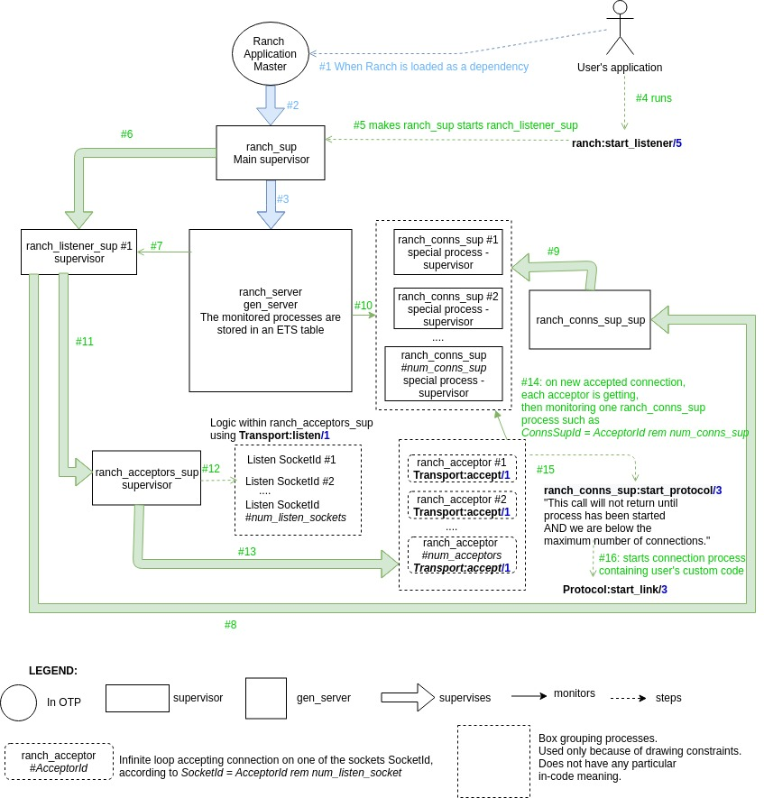

[#chapter-five]
= Conclusion

What is Ranch?
Ranch is a "Socket acceptor pool for TCP protocols".

How is it functionally working?

image:schema/Ranch_Summary_Architecture.jpg[title="How Ranch works?"]

What about the under the hood module interactions?

TODO: under the hood module analysis when calling other API functions than `ranch:start_listener/5`.
You're welcome to open issues and send pull-request to our GitHub repository.