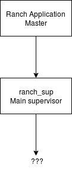
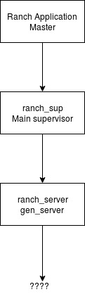
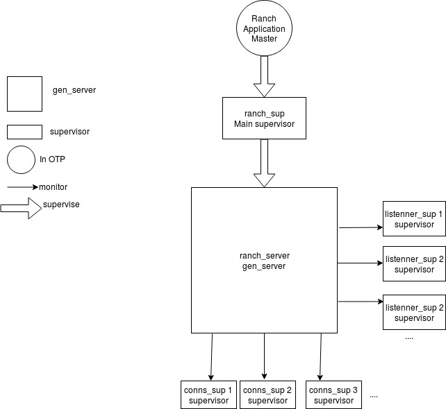

[#chapter-four]
= Diving into Ranch Source code

We'll simply navigate file by file,
starting by the entry point of the application.

== ebin/ranch.app

This is the main file defining the project.
Let's decrypt it together and remind ourselves what is the meaning of the different values.

* `{application, 'ranch'}`
** Thats the name of the OTP application being created. `'ranch'` is an atom.
* `{description, "Socket acceptor pool for TCP protocols."}`
** The description of the application. A string.
* `{vsn, "2.0.0-rc.1"}`
** The version of the application. A string.
* `{modules, ['ranch','ranch_acceptor','ranch_acceptors_sup','ranch_app','ranch_conns_sup','ranch_conns_sup_sup','ranch_crc32c','ranch_embedded_sup','ranch_listener_sup','ranch_protocol','ranch_proxy_header','ranch_server','ranch_server_proxy','ranch_ssl','ranch_sup','ranch_tcp','ranch_transport']}`
** _"All modules introduced by this application. systools uses this list when generating start scripts and tar files. A module can only be defined in one application."_
** It does correspond to all the `.erl` files of the `src/` folder.
* `{registered, [ranch_sup,ranch_server]}`
** The list of processes that will be accessible by their name instead of only by PID (== registered processes, see http://erlang.org/doc/reference_manual/processes.html#registered-processes[official Erlang documentation]).
* `{applications, [kernel,stdlib,ssl]}`
** _"All applications that must be started before this application is allowed to be started. systools uses this list to generate correct start scripts. Defaults to the empty list, but notice that all applications have dependencies to (at least) Kernel and STDLIB."_
*** Here we can note that Ranch needs the ssl external module to be loaded beforehand. Obviously, Ranch does use this security protocol so it makes sense.
* `{mod, {ranch_app, []}}`
** _"Specifies the application callback module and a start argument, see application(3). Key mod is necessary for an application implemented as a supervision tree, otherwise the application controller does not know how to start it. mod can be omitted for applications without processes, typically code libraries, for example, STDLIB."_
*** That's interesting! The starting point of the application being always `ranch_app`. We'll keep that in mind and start by this file for our source code anaylisis in the next chapter.
* `{env, []}`
** "Configuration parameters used by the application. The value of a configuration parameter is retrieved by calling application:get_env/1,2. The values in the application resource file can be overridden by values in a configuration file (see config(4)) or by command-line flags (see erts:erl(1))."
*** No default configuration parameter being set here.

]}.

Source: http://erlang.org/doc/man/app.html[Official Erlang Documentation]

== ranch_app.erl

Yep, it has `-behaviour(application)`, which makes sense because it is part of the `mod` parameter above.
The file is quite small and easy to understand.

.Two things to notice here:
* that's where profiling logic is in
* `ranch_sup:start_link/0` is run on start of the application.

That's the supervisor for the whole Ranch app.
We can now start our supervisor tree:

See https://learnyousomeerlang.com/building-otp-applications#the-application-behaviour[LYSEFGG] for more info on the Application Master.
Let's dive in ranch_sup to know what's behind these question marks.

== ranch_sup.erl

As expected, it implements the `supervisor` behaviour.

The following code:

`start_link() ->
	supervisor:start_link({local, ?MODULE}, ?MODULE, []).`

is standard. No argument will be passed to `init/1`.

`init/1` with an empty argument list will be run in the spawned supervisor process.
We will now study its content.

=== The restart intensity configuration parameters

`application:get_env(ranch_sup_intensity)` is used to access the `ranch_sup_intensity` configuration parameter.
Similarly the `ranch_sup_period` configuration parameter is being accessed.

Then it is returned by the `init/1` function as follow:
`{ok, {#{intensity => Intensity, period => Period}, Procs}}`.

.What is the meaning of these parameters? Quote from the official documentation:
* _"To prevent a supervisor from getting into an infinite loop of child process terminations and restarts, a maximum restart intensity is defined using two integer values specified with keys intensity and period in the above map. Assuming the values MaxR for intensity and MaxT for period, then, if more than MaxR restarts occur within MaxT seconds, the supervisor terminates all child processes and then itself. The termination reason for the supervisor itself in that case will be shutdown. intensity defaults to 1 and period defaults to 5."_
* See http://erlang.org/doc/man/supervisor.html#supervision_princ[official Erlang documentation]

Interestingly, these configuration parameters are not documented in the official Ranch Documentation. In `migration_from_1.5.asciidoc`, I quote:

_"It is now possible to configure the restart intensity for
`ranch_sup` using the OTP application environment. This
feature will remain undocumented unless there is popular
demand for it."_

.How would you use these parameters? A quick search shows these examples from a unit test in `test/ranch_ct_hook.erl`:
* `application:set_env(ranch, ranch_sup_intensity, 10)`
* `application:set_env(ranch, ranch_sup_period, 1)`

=== The ChildSpec

The last parameter returned by `init/1` is the variable `Procs` that corresponds to
what's called `ChildSpec` in the official Erlang documentation.

.We have the following:
* `Procs = [#{id => ranch_server, start => {ranch_server, start_link, []}}`

which is pretty standard.

`ranch_sup` is therefore supervising `ranch_server`, which entry point is `start_link/0`.

We can update our supervision tree:

It is also worth noticing that an ETS table is being initialized using `ets:new/2`.
The ETS table is named after `ranch_server` module so it is expected that this module will be interacting with it.

== ranch_server.erl

The first thing to notice is that it implements `gen_server`, as expected by its name.

.Which state is that `gen_server` keeping? As usual, you need to look for it at the beginning of the file, after the list of `export`:
* A macro `TAB` is being defined as `?MODULE` but not used throughout the whole file - which is a bit awkard. Sometimes we see the usage of `?MODULE`, sometimes `?TAB`.
I don't understand the point of this macro.
Maybe there's a good reason for it that I am missing out.
* The interesting part is the record `state` being initialized with an empty list. `state` record contains a value of type `monitors()` which is itself defined as follows:
** `[{{reference(), pid()}, any()}]` see http://erlang.org/doc/reference_manual/typespec.html[official Erlang documentation]
for explanation of the types

`start_link/0` without surprises is running `gen_server:start_link/4`, with standard arguments.

We know that the `init/1` function is the starting point of this process. We therefore scroll the file down to see its implementation.

As expected, `init/1` returns `{ok, State}` with `State` being here
of type `state`, record defined previously (see above).

The list of all connections and listener supervisors is fetched from the ETS table previously created.
`ranch_server` starts monitoring them,
and store the returned reference in the state,
together with its corresponding Pid,
the Reference of the supervisor process itself,
and its Id (for connection supervisor).

From that point on, it would be interesting to look for the location where the connection and listener supervisors
are added to the ETS table.

To do so, we can search for "conns_sup" or "listener_sup" or "ets:insert" in the project.

.The following appears in `ranch_server:handle_call/3`:
* `State = set_monitored_process({conns_sup, Ref, Id}, Pid, State0)`
* `State = set_monitored_process({listener_sup, Ref}, Pid, State0)`

`ranch_server:set_monitored_process/3` is simply making `ranch_server` process monitor the connection/listener supervisor,
updates the ETS Table accordingly and returns the new updated state.

.There are a few things I don't understand here:
* Why is `erlang:monitor(process, Pid)` being called in `init/1`?
It will stack with another monitoring reference,
because the supervisors fetched from the ETS Table are supposed to be already monitored
(see `ranch_server:set_monitored_process/3`)...
Why isn't the ETS Table also storing the MonitorRef? It would avoid having to do that...
Or is that the intended behaviour?
* In any case, most likely, the ETS Table will be empty at this point,
because `ranch_server:init/1`
has to have finished running before the `ranch_server` gen_server becomes actually
available for users, and before they can eventually call `ranch_server:handle_call/3`!
Therefore, the returned initial state will be empty on start of `ranch_server` and the code
that fetch the ETS Table is irrelevant... *Hmm, but what happens when `ranch_server` dies and is restarted by `ranch_sup`?
In this case, there will still be data in the ETS Table, data that will be monitored by...
the `ranch_server` process that just died! So, basically not monitored at all!
That's it! That's the reason why the use of `erlang:monitor(process, Pid)` in `ranch_server:init/1` does not stack with another monitoring.
Its only (and important!) point is in case the process that was previously monitoring died!*

We can now improve our schema:

.The questions raised are now:
* what is conns_sup? what is listenner_sup?
* in which context are they initialized?

For that we will search for `set_connections_sup` and `set_listener_sup` in the project.

.We spot that:
 * `ranch_server:set_connections_sup/3` is used in `ranch_conns_sup:init/7`
 * `ranch_server:set_listener_sup/2` is used in `ranch_listener_sup:init/1`

.A quick search also shows that `ranch_server:get_listener_sup/1` is used in:
* `ranch:get_status/1`.
* `ranch:suspend_listener/1`
* `ranch:resume_listener/1`
* `ranch:remove_connection/1`
* `ranch:info/0` and `ranch:info/1`
* `ranch:procs/1`

.Similarly, `ranch_server:get_connections_sup/1` is used in:
* `ranch:get_connections/2`
* `ranch:apply_transport_options/2`

These functions are the API that's accessible by the user of the library.
They are features.
See the official documentation to know more about their usage.

Finally, `ranch_server:get_connections_sup/2` is used by `ranch_acceptor:start_link/5`.
We will see how and why later.

Now we need to answer the questions:
- what is a listener? what is a connection? what is an acceptor?
TODO explain that earlier in the guide

== ranch_listener_sup.erl

It implements the `supervisor` behaviour, as expected.

This file is very simple. It basically starts two children, both being supervisors:
`ranch_conns_sup_sup` and `ranch_acceptors_sup`. The restart strategy is `rest_for_one`.
It means that if `ranch_conns_sup_sup` dies, then `ranch_acceptors_sup`
will be terminated and then both will be restarted sequentially.
However, if `ranch_acceptors_sup` dies it will be restarted but `ranch_conns_sup_sup` will not be affected.

Before going forward with studying the files exposed here, let's wait for a minute
and wonder how does this `ranch_listener_sup` module is being instanciated on the first place.
It seems that it is a central part of the software, considering it is starting
the supervisors that will ultimately start the listener socket.

TODO rephrase this sentence earlier. Actually answer the question.

== ranch_conns_sup.erl

As expected, it implements the `supervisor` behaviour.
We notice that this file maintains a `state` record, that, in particular hold the Parent Pid
of this supervisor.

It means that, this supervisor has a parent supervisor...
A quick search shows that it is actually `ranch_conns_sup_sup` which instanciate it.
We'll see in depth that later.

TODO : rephrase the sentence above. Should have been answered earlier already.
